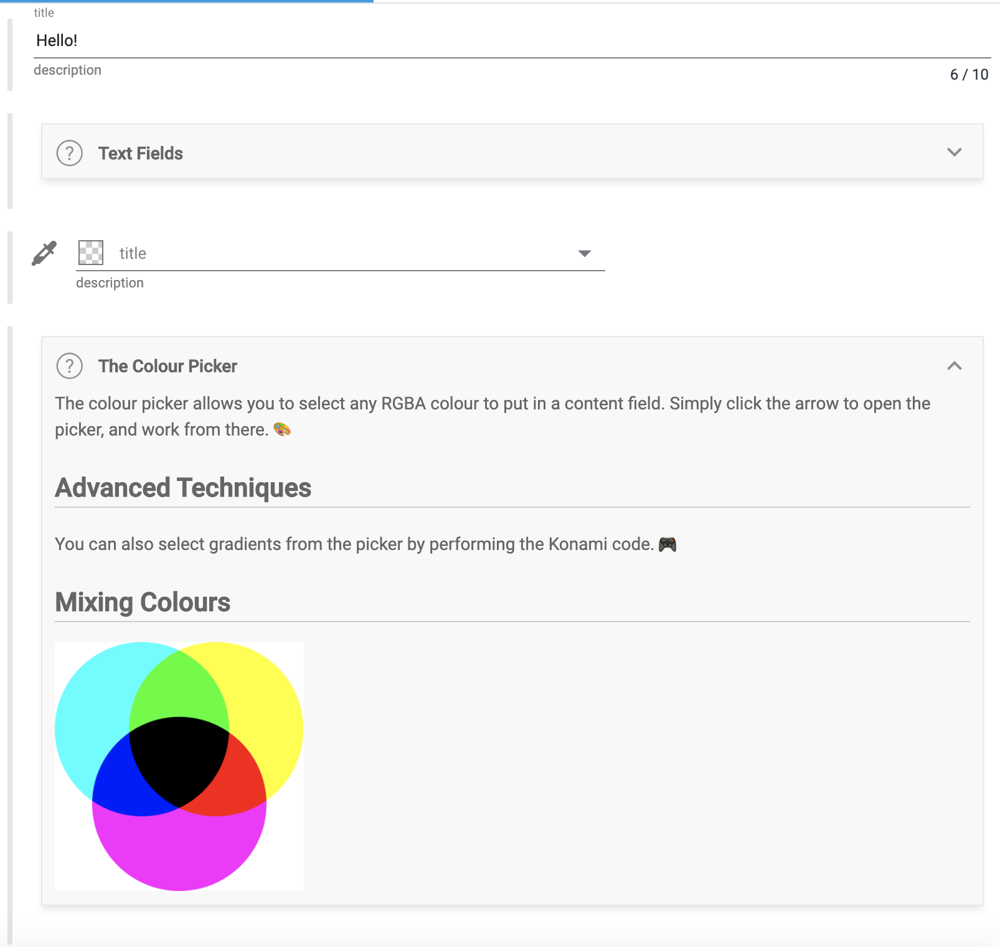
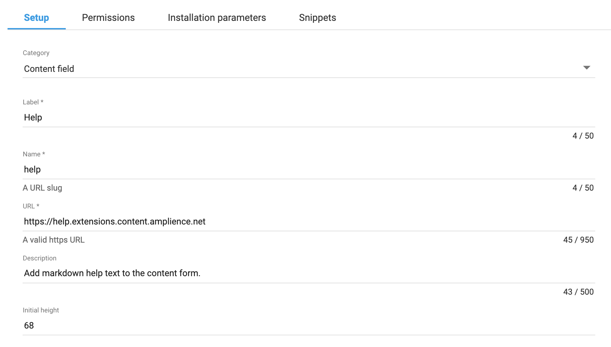

[](https://amplience.com/dynamic-content)



# Dynamic Content Help Block Extension
Extension that adds a help block to a content item. This creates a placeholder field that simply shows helpful information of your choosing in the content item editor.

## How to install

### Register Extension

This extension needs to be [registered](https://amplience.com/docs/development/registeringextensions.html) against a Hub with in the Dynamic Content application (Developer -> Extensions), for it to load within that Hub.

#### Setup



* Category: Content Field
* Label: Help _(this will appear as the tab title in the Dashboard)_
* Name: help _(needs to be unique with the Hub)_
* URL: [https://help.extensions.content.amplience.net](https://help.extensions.content.amplience.net)
* Description: Help _(can be left blank, if you wish)_

To use the application the following permissions must be enabled:

Note:
You can use our deployed version of this extension (builds from the "production" branch) -

[https://help.extensions.content.amplience.net](https://help.extensions.content.amplience.net)

_As this is an open source project you're welcome to host your own "fork" of this project. You can use any standard static hosting service (Netlify, Amplify, Vercel, etc.) if you wish._

##### Permissions

This extension requires no additional permissions.

## Example extension snippet

```json
{
    "type": "object",
    "ui:extension": {
      "name": "help",
      "params": {
          "title": "Help Message Title",
          "message": "Markdown message body. Replace with any markdown string."
      }
    }
}
```

## Use
In any content item, add a field with type `null` that uses this UI extension. 

You can send a `title` and `message` to it as params, which will appear in the help block. The `message` will be parsed as markdown. HTML is allowed in the markdown, though there are some restrictions that will prevent you running scripts etc (provided via `js-xss`).

Example:

```json
"help": {
  "type": "null",
  "ui:extension": {
    "name": "help",
    "params": {
      "title": "Put the title to be shown to the user",
      "message": "Place any markdown content in here....."	
    }
  }
}

```

## Building Locally
Local builds can be tested directly (using the default test data) or by setting up a JSON schema that links to your localhost instance.
- `npm i`
- `npm run build` / `npm start` (for live reload)

## Setting up the Snippet in DC
Extension Snippets are an easy way to add extensions to content types while allowing you to easily change the extension url and base extension properties from one spot. 

You can find a snippet to use for this extension in: `snippet.json`. Recommended description:
> Add a help block to this content item. This creates a placeholder field that simply shows helpful information of your choosing in the content item editor.

You can even add your locally hosted help block extension this way for development, though note that it expects the extension url to be https. Our hosted version is a quick way to access the current version of the extension:

- https://help.extensions.content.amplience.net